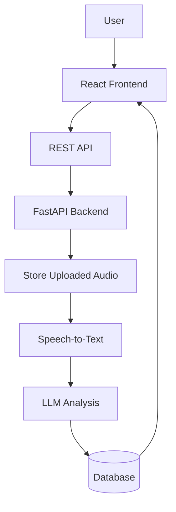

# AI-Powered Meeting Summarizer

Production-oriented full-stack application that uploads meeting audio, transcribes it with Whisper, summarizes it with Gemini 2.5 Flash, and stores the structured output in SQLite with a path that can later move to PostgreSQL.

## Tech Stack

- Frontend: React, Vite, Axios
- Backend: FastAPI, Uvicorn
- Database: SQLite now, PostgreSQL-ready design
- AI: Whisper transcription and Gemini 2.5 Flash summarization

## Architecture



## Folder Structure

```text
backend/
  app/
    main.py
    database.py
    models.py
    schemas.py
    config.py
    routes/
    services/
    uploads/
  requirements.txt

frontend/
  src/
    components/
    pages/
    services/
    App.jsx
  package.json
```

## Setup

### Backend

1. Create a virtual environment and install dependencies from `backend/requirements.txt`.

```bash
cd backend
pip install -r requirements.txt
```

### Frontend

1. Install the frontend dependencies in `frontend`.

```bash
cd frontend
npm install
```

```bash
npm run dev
```

## Environment Variables

### Backend

- `DATABASE_URL` - SQLite
- `UPLOAD_DIR` - storage directory for uploaded audio
- `MAX_UPLOAD_MB` - file size limit
- `TRANSCRIPTION_PROVIDER` - `local` or
- `GEMINI_API_KEY` - required for summary generation
- `GEMINI_MODEL` - defaults to `gemini-2.5-flash`
- `WHISPER_MODEL` - local Whisper model name such as `small`
- `QUEUE_WORKERS` - number of background processing workers
- `DIARIZATION_PROVIDER` - `fallback` or `pyannote`
- `PYANNOTE_AUTH_TOKEN` - only needed when using `pyannote`


### Frontend

- `VITE_API_BASE_URL` - backend API base URL

## API Documentation

- `POST /upload` - upload an audio file and create a meeting record
- `POST /process/{meeting_id}` - transcribe and summarize the uploaded file
- `GET /meeting/{id}` - fetch one processed meeting
- `GET /meetings` - list processed meetings
- `GET /search/meetings` - search meetings by transcript, summary, or filename
- `GET /meeting/{id}/pdf` - download a PDF summary for a meeting
- `DELETE /meeting/{id}` - delete a meeting and remove its stored file

<<<<<<< HEAD
=======
## Screenshots

Add submission screenshots here before final delivery:

- Landing page
- Upload flow in progress
- Transcript and summary dashboard

## Future Improvements

- Background job queue for longer processing tasks
- PostgreSQL migration scripts
- Speaker diarization
- PDF export
- Full-text meeting search

>>>>>>> f465dc0 (Improved UI and updated documentation)
## Notes

- Routes only coordinate work; transcription and summarization live in dedicated services.
- The data model uses JSON fields for key points and action items so the same schema maps cleanly to PostgreSQL later.
